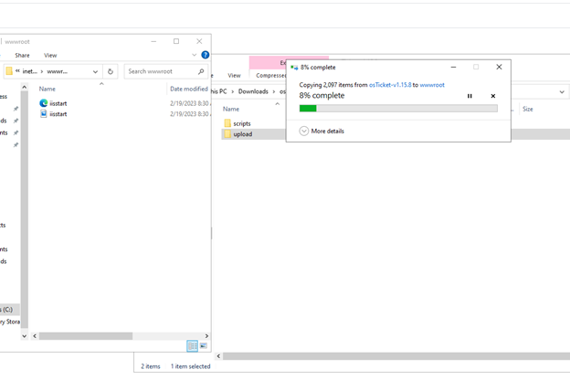
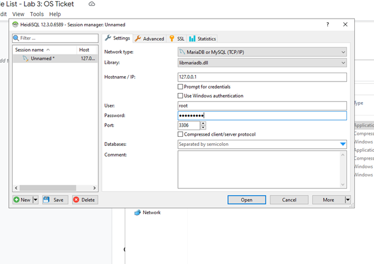
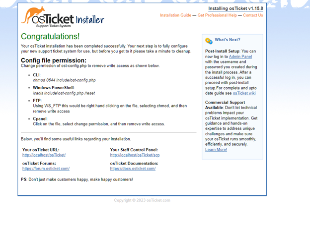

<h1>osTicket - Prerequisites and Installation</h1>
This tutorial outlines the prerequisites and installation of the open-source help desk ticketing system osTicket. 

<h2>Environments and Technologies Used</h2>

- Microsoft Azure (Virtual Machines/Compute)
- Remote Desktop
- Internet Information Services (IIS)

<h2>Operating Systems Used </h2>

- Windows 10</b> (21H2)

<h2>List of Prerequisites</h2>

- Create Virtual Machine in Azure
- Install Web Platform Installer
- Install osTicket v1.15.8
- Install HeidiSQL

<h2>Installation Steps</h2>

### Create Virutal Machine in Azure

Create a Resource Group

Create a Windows 10 Virtual Machine (VM) with 2-4 Virtual CPUs When creating the VM, allow it to create a new Virtual Network (Vnet):

Windows Virutal Machine

Connect to your Virtual Machine with Remote Desktop

Install / Enable IIS in Windows WITH CGI

 World Wide Web Services -> Application Development Features -> [X] CGI

Download and install PHP Manager for IIS (PHPManagerForIIS_V1.5.0.msi)

Download and install the Rewrite Module (rewrite_amd64_en-US.msi)
 
 
 
Create the directory C:\PHP

Download PHP 7.3.8 (php-7.3.8-nts-Win32-VC15-x86.zip) and unzip the contents into C:\PHP

Download and install VC_redist.x86.exe

Download and install MySQL 5.5.62 (mysql-5.5.62-win32.msi)

Typical Setup ->
Launch Configuration Wizard (after install) ->
Standard Configuration ->
Password1

Open IIS as an Admin

Register PHP from within IIS

Reload IIS (Open IIS, Stop and Start the server)

Install osTicket v1.15.8

Download osTicket (download from within lab files: link).

Extract and copy the “upload” folder INTO c:\inetpub\wwwroot:

Within c:\inetpub\wwwroot, Rename “upload” to “osTicket”:

rename to osTicket

Reload IIS (Open IIS, Stop and Start the server)

Go to sites -> Default -> osTicket:

On the right, click “Browse *:80”:

Enable Extensions in IIS: Note that some extensions are not enabled

Go back to IIS, sites -> Default -> osTicket.

Double-click PHP Manager:

Click “Enable or disable an extension”.

Enable: php_imap.dll.

Enable: php_intl.dll.

Enable: php_opcache.dll:

Refresh the osTicket site in your browser, observe the changes

Rename

From: C:\inetpub\wwwroot\osTicket\include\ost-sampleconfig.php.

To: C:\inetpub\wwwroot\osTicket\include\ost-config.php:

Assign Permissions: ost-config.php

Disable inheritance -> Remove All:

New Permissions -> Everyone -> All:

Continue Setting up osTicket in the browser (click Continue)

Name SnehHelpdesk.

Default email (receives email from customers):

> Download and Install HeidiSQL

Create a new session, root/Password1.

Connect to the session:

Create a database called “osTicket”:

> Continue Setting up osTicket in the browser

MySQL Database: osTicket

MySQL Username: root

MySQL Password: Password1:

Click “Install Now!”

Congratulations, hopefully it is installed with no errors!

> Clean up

Delete: C:\inetpub\wwwroot\osTicket\setup:

Set Permissions to “Read” only: C:\inetpub\wwwroot\osTicket\include\ost-config.php:

> Login to the osTicket Admin Panel (http://localhost/osTicket/scp/login.php)

I wish you luck installing osTicket using this guide.

And right now, you may practice running your own fictitious help desk locally to be ready for a job in an IT support or help desk role.

💡 Do not forget clean up your environment in Azure.

### *References:*
[Link to download files](https://docs.google.com/document/d/12QH7yrsaiUfYNOgZK7KgTSZQSJ-HYTSVcGFildWMRig/edit#)

