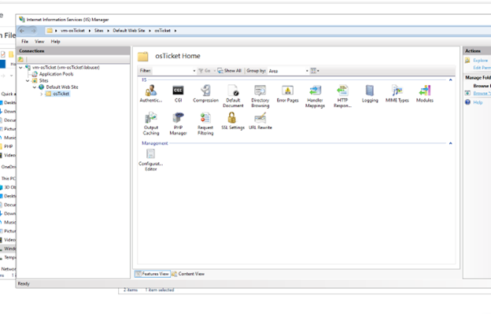

<h1>osTicket - Prerequisites and Installation</h1>
This tutorial outlines the prerequisites and installation of the open-source help desk ticketing system osTicket. 

<h2>Environments and Technologies Used</h2>

- Microsoft Azure (Virtual Machines/Compute)
- Remote Desktop
- Internet Information Services (IIS)

<h2>Operating Systems Used </h2>

- Windows 10</b> (21H2)

<h2>List of Prerequisites</h2>

- Create Virtual Machine in Azure
- Install Web Platform Installer
- Install osTicket v1.15.8
- Install HeidiSQL

<h2>Installation Steps</h2>

### Create Virutal Machine in Azure

Create a Resource Group

Create a Windows 10 Virtual Machine (VM) with 2-4 Virtual CPUs When creating the VM, allow it to create a new Virtual Network (Vnet):

Windows Virutal Machine

Connect to your Virtual Machine with Remote Desktop

Install / Enable IIS in Windows

Enable IIS in Windows

Install Web Platform Installer

Open after installation:

Add MySQL 5.5 (it will ask for credentials to be created later).

Name: root

Password: Password1:

Add All simple versions of x86 PHP up until 7.3:

Fix any failures if required.

Install PHP Version 7.3.8 (or any other version if necessary, archives).

Install Microsoft Visual C++ 2009 Redistributable Package (if necessary).

Install PHP Manager 1.5.0 for IIS 10:

Install osTicket v1.15.8

Download osTicket (download from within lab files: link).

Extract and copy the “upload” folder INTO c:\inetpub\wwwroot:

Within c:\inetpub\wwwroot, Rename “upload” to “osTicket”:

rename to osTicket

Reload IIS (Open IIS, Stop and Start the server)

Go to sites -> Default -> osTicket:

On the right, click “Browse *:80”:

Enable Extensions in IIS: Note that some extensions are not enabled

Go back to IIS, sites -> Default -> osTicket.

Double-click PHP Manager:

Click “Enable or disable an extension”.

Enable: php_imap.dll.

Enable: php_intl.dll.

Enable: php_opcache.dll:

Disk Sanitization Steps

Refresh the osTicket site in your browser, observe the changes

Rename

From: C:\inetpub\wwwroot\osTicket\include\ost-sampleconfig.php.

To: C:\inetpub\wwwroot\osTicket\include\ost-config.php:

Assign Permissions: ost-config.php

Disable inheritance -> Remove All:

New Permissions -> Everyone -> All:

Continue Setting up osTicket in the browser (click Continue)

Name Helpdesk.

Default email (receives email from customers):

> Download and Install HeidiSQL

Create a new session, root/Password1.

Connect to the session:

Create a database called “osTicket”:

> Continue Setting up osTicket in the browser

MySQL Database: osTicket

MySQL Username: root

MySQL Password: Password1:

Click “Install Now!”

Congratulations, hopefully it is installed with no errors!

> Clean up

Delete: C:\inetpub\wwwroot\osTicket\setup:

Set Permissions to “Read” only: C:\inetpub\wwwroot\osTicket\include\ost-config.php:

> Login to the osTicket Admin Panel (http://localhost/osTicket/scp/login.php)

And there you have it! I hope this tutorial helped you with installing osTicket.

And now you can practice having your own mock help desk locally to prepare you for a postion in a help desk or IT support position.

